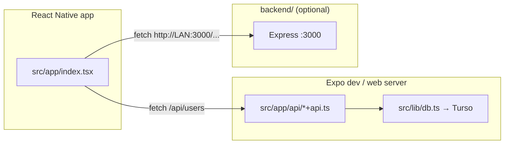

<div align="center">

# expo-networking

**Learn mobile networking with Expo — API routes, Turso, and a standalone Express server.**

[](https://docs.expo.dev/versions/v55.0.0/)
[](https://docs.expo.dev/router/introduction/)
[](https://reactnative.dev/)
[](https://www.typescriptlang.org/)

[Getting started](#-getting-started) · [Navigation](#-navigation) · [Routes](#-routes) · [Project structure](#-project-structure) · [Learn more](#-learn-more)

</div>

An [Expo SDK 55](https://docs.expo.dev/versions/v55.0.0/) demo app that shows how to call **API routes** from a React Native client. Routes run on the server (Expo Router `+api` files) and read/write data in a remote [Turso](https://turso.tech/) (libSQL) database.

The repo also includes a small **Express** backend under `backend/` for calling a traditional HTTP server from the device (useful when comparing Expo API routes vs. a separate Node server).

---

## Table of contents

- [expo-networking](#expo-networking)
  - [Table of contents](#table-of-contents)
  - [Features](#features)
  - [Architecture](#architecture)
  - [Tech stack](#tech-stack)
  - [Project structure](#project-structure)
  - [Prerequisites](#prerequisites)
  - [Environment variables](#environment-variables)
  - [Get started](#get-started)
    - [1. Install app dependencies](#1-install-app-dependencies)
    - [2. Configure Turso](#2-configure-turso)
    - [3. Start Expo](#3-start-expo)
    - [4. Run on a target](#4-run-on-a-target)
    - [Scripts](#scripts)
  - [Express backend (optional)](#express-backend-optional)
    - [Setup](#setup)
    - [Sample endpoint](#sample-endpoint)
    - [Call from the app](#call-from-the-app)
  - [API routes](#api-routes)
    - [`GET /api/users`](#get-apiusers)
    - [`POST /api/users`](#post-apiusers)
    - [`GET /api/users/:id`](#get-apiusersid)
    - [Quick test with curl (web / same origin)](#quick-test-with-curl-web--same-origin)
  - [How the client calls the API](#how-the-client-calls-the-api)
  - [Troubleshooting](#troubleshooting)
  - [Learn more](#learn-more)

---

## Features

- **Expo Router** file-based routing under `src/app`
- **API routes** (`+api.ts`) for REST-style endpoints — no separate Express server required for Turso CRUD
- **Turso / libSQL** via `@libsql/client` for persistence
- **Home screen** with buttons to exercise `GET` and `POST` against `/api/users`, plus `GET` by id
- **Optional Express server** in `backend/` with a sample `GET /api/v1/hello-world` endpoint
- **Typed routes** and **React Compiler** enabled via `app.json` experiments

---

## Architecture

Two ways to reach a server from the app:



| Approach            | When to use                                                              | Base URL                    |
| ------------------- | ------------------------------------------------------------------------ | --------------------------- |
| **Expo API routes** | Same-origin calls during dev; Turso-backed CRUD without a second process | `/api/...` (relative)       |
| **Express backend** | Practice hitting a separate host/port; CORS, deployment, or legacy APIs  | `http://<your-lan-ip>:3000` |

`app.json` sets `web.output` to `"server"` so API routes work on web builds.

---

## Tech stack

| Layer           | Choice                                                                            |
| --------------- | --------------------------------------------------------------------------------- |
| Framework       | Expo ~55, React Native 0.83, React 19                                             |
| Routing         | [expo-router](https://docs.expo.dev/router/introduction/)                         |
| API             | Expo [API routes](https://docs.expo.dev/router/reference/api-routes/) (`+api.ts`) |
| Database        | [Turso](https://turso.tech/) via `@libsql/client`                                 |
| Optional server | Express 5 (`backend/`)                                                            |
| Language        | TypeScript (strict)                                                               |

Path alias: `@/*` → `./src/*` (see `tsconfig.json`).

---

## Project structure

```
expo-networking/
├── src/
│   ├── app/
│   │   ├── _layout.tsx              # Root stack navigator
│   │   ├── index.tsx                # Home screen (network calls from UI)
│   │   └── api/
│   │       ├── users+api.ts         # GET (list), POST (create)
│   │       └── users/[id]+api.ts    # GET by id (PATCH/PUT/DELETE stubs)
│   └── lib/
│       └── db.ts                    # Turso client (env-based config)
├── backend/
│   ├── index.js                     # Express app (hello-world sample)
│   └── package.json
├── assets/                          # App icons and splash assets
├── .env.sample                      # Required environment variable names
├── app.json
└── package.json
```

---

## Prerequisites

1. **Node.js** (LTS recommended) and a package manager (`npm`, `yarn`, `pnpm`, or `bun`)
2. A **Turso** database with a `users_data` table (for Expo API routes)
3. For **physical devices** calling Express: your machine and phone on the **same Wi‑Fi**, and the LAN IP in `fetch` URLs updated to match your machine

Create the table (adjust types if needed):

```sql
CREATE TABLE users_data (
  id INTEGER PRIMARY KEY AUTOINCREMENT,
  name TEXT NOT NULL,
  email TEXT NOT NULL
);
```

---

## Environment variables

Copy `.env.sample` to `.env` and fill in your Turso credentials:

```bash
cp .env.sample .env
```

| Variable             | Description                                              |
| -------------------- | -------------------------------------------------------- |
| `TURSO_DATABASE_URL` | libSQL connection URL (e.g. `libsql://your-db.turso.io`) |
| `TURSO_AUTH_TOKEN`   | Turso auth token for remote access                       |

`.env` is gitignored; never commit real tokens.

---

## Get started

### 1. Install app dependencies

```bash
npm install
```

### 2. Configure Turso

Set `TURSO_DATABASE_URL` and `TURSO_AUTH_TOKEN` in `.env` (see [Environment variables](#environment-variables)).

### 3. Start Expo

```bash
npx expo start
```

### 4. Run on a target

| Target   | Command                                     |
| -------- | ------------------------------------------- |
| Dev menu | `npx expo start` then press `a` / `i` / `w` |
| Android  | `npm run android`                           |
| iOS      | `npm run ios`                               |
| Web      | `npm run web`                               |

Open the app on a device or simulator. The home screen can load `GET /api/users` on mount and provide buttons to retry list/create/fetch-by-id calls. Responses appear as formatted JSON below the buttons.

### Scripts

| Command           | Description           |
| ----------------- | --------------------- |
| `npm start`       | Start Expo dev server |
| `npm run android` | Start with Android    |
| `npm run ios`     | Start with iOS        |
| `npm run web`     | Start with web        |
| `npm run lint`    | Run ESLint via Expo   |

---

## Express backend (optional)

Use this when you want the app to talk to a **separate** Node server instead of (or in addition to) Expo API routes.

### Setup

```bash
cd backend
npm install
npm run dev
```

Server listens on **port 3000**.

### Sample endpoint

| Method | Path                  | Response                    |
| ------ | --------------------- | --------------------------- |
| `GET`  | `/api/v1/hello-world` | `{ "data": "Hello world" }` |

### Call from the app

On a **physical device** or **emulator**, `localhost` on the phone is not your PC. Use your computer’s LAN IP:

```ts
// Example — replace with your machine's IP
const res = await fetch("http://192.168.1.2:3000/api/v1/hello-world");
const data = await res.json();
```

> **Tip:** Find your IP with `ipconfig` (Windows) or `ifconfig` / `ip addr` (macOS/Linux). Update the URL in `src/app/index.tsx` whenever your network or IP changes.

---

## API routes

Routes are defined under `src/app/api/` and are served at `/api/...` relative to the dev server origin.

### `GET /api/users`

Returns all rows from `users_data`.

**Example response:**

```json
[{ "id": 1, "name": "Jane Doe", "email": "jane@example.com" }]
```

### `POST /api/users`

Body (JSON):

```json
{ "name": "Jane Doe", "email": "jane@example.com" }
```

Returns `201` with `{ id, name, email, success: true }` on success. Requires `name` and `email`.

| Status | Meaning                   |
| ------ | ------------------------- |
| `201`  | Created                   |
| `400`  | Missing `name` or `email` |
| `500`  | Database error            |

### `GET /api/users/:id`

Returns the user row matching `id` (integer).

`PATCH`, `PUT`, and `DELETE` handlers exist as stubs in `users/[id]+api.ts` and are not implemented yet.

### Quick test with curl (web / same origin)

With the dev server running and API routes available:

```bash
curl http://localhost:8081/api/users
curl -X POST http://localhost:8081/api/users \
  -H "Content-Type: application/json" \
  -d '{"name":"Test","email":"test@example.com"}'
```

Port may differ; check the Expo terminal for the actual URL.

---

## How the client calls the API

`src/app/index.tsx` uses `fetch` with relative URLs (e.g. `/api/users`) for Expo API routes. On web and in Expo’s dev workflow, those resolve to the same origin as the API routes, so no hard-coded backend host is required for local development.

For the Express sample, use an absolute URL with your LAN IP (see [Express backend](#express-backend-optional)).

```ts
// Expo API route (relative — same origin in dev)
await fetch("/api/users");

// Express (absolute — separate server)
await fetch("http://192.168.1.2:3000/api/v1/hello-world");
```

---

## Troubleshooting

| Problem                                       | Things to try                                                                                    |
| --------------------------------------------- | ------------------------------------------------------------------------------------------------ |
| `Failed to fetch users` / 500 from API routes | Confirm `.env` Turso vars; table `users_data` exists; token not expired                          |
| Network request failed (Express)              | Same Wi‑Fi; correct LAN IP; firewall allows port 3000; backend running                           |
| `localhost` works on web but not on phone     | Expected — use LAN IP for device → machine calls                                                 |
| API routes empty on native                    | Ensure Expo dev server is running; use full dev workflow (not only static export without server) |
| Env vars not picked up                        | Restart `npx expo start` after changing `.env`                                                   |

---

## Learn more

- [Expo documentation](https://docs.expo.dev/) — use the [v55](https://docs.expo.dev/versions/v55.0.0/) docs for this project
- [Expo Router API routes](https://docs.expo.dev/router/reference/api-routes/)
- [Turso + libSQL](https://docs.turso.tech/)
- [React Native networking](https://reactnative.dev/docs/network)
- [Express 5 guide](https://expressjs.com/)

---

<div align="center">

<sub>Built for learning mobile networking patterns with Expo SDK 55.</sub>

</div>
